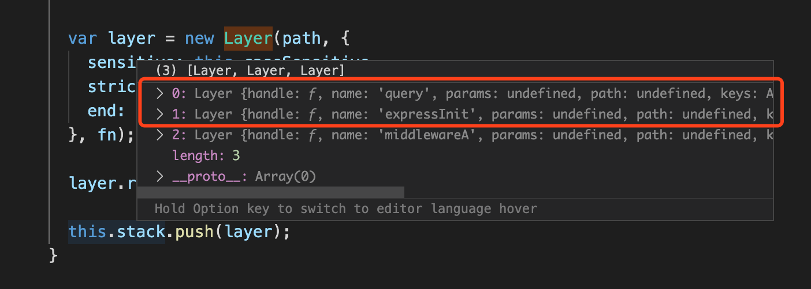

最早接触中间件，是在第一次使用 express 框架的时候，那时对中间件的作用有了了解，后面再使用 Koa 框架时，也遇到了中间件，最大的使用感受就是中间件的参数不一样了，可以使用`await`语法来执行`next()`函数。几乎于此同时，使用的 Redux 也提出了中间件的概念。中间件的概念被广泛的采用，一定有其优势所在。
本篇文章尝试分析和比较 Express Koa2 Redux 这三个框架的实现原理。

调试这三个框架的源码其实非常简单。

1. 书写一个 js 文件，编写代码。
2. 使用 vscode 的 debug 功能启动代码。
3. 使用 curl 请求 localhost。

## Express 的中间件

express 是内置路由功能的，并且同时内置了`static`,`json`,`urlencoded` 这三个中间件。

下面是启动一个 express app 并注册 App-Level middleware 的代码。通过这段代码来分析 express 启动和中间件运行流程。

```javascript
// express相当于一个工厂函数，它会返回一个函数，也就是app
const express = require("express");
const app = express();
app.use(function middlewareA(req, res, next) {
  console.log("1");
  next();
  console.log("2");
});
app.use(function middlewareB(req, res, next) {
  console.log("3");
  next();
  console.log("4");
});
app.use(function middlewareC(req, res, next) {
  res.send("hello world");
});
app.listen(3000);
```

以上代码返回了一个 express 实例，不过这个实例，是一个挂载了很多属性的函数。下面是`express()`的调用，在源码中就是`createApplication()`的调用。如下是源码部分。

```javascript
// express/lib/express.js
function createApplication() {
  // 定义app是一个函数。
  var app = function (req, res, next) {
    // app.handle 是通过mixin的方式组合进来的
    app.handle(req, res, next);
  };

  // 使用组合的方式，给app这个函数上挂载通用方法。
  mixin(app, EventEmitter.prototype, false);
  mixin(app, proto, false);

  // expose the prototype that will get set on requests
  app.request = Object.create(req, {
    app: { configurable: true, enumerable: true, writable: true, value: app },
  });

  // expose the prototype that will get set on responses
  app.response = Object.create(res, {
    app: { configurable: true, enumerable: true, writable: true, value: app },
  });

  app.init();

  // 返回app函数
  return app;
}
```

app 通过 mixin 的方式挂载了很多的方法，其中就包含了 `use` 和 `listen` 方法。他们的源码如下。精简了一下代码。

```javascript
// express/lib/application.js
app.use = function use(fn) {
  var path = "/";

  // setup router
  this.lazyrouter();
  var router = this._router;

  fns.forEach(function (fn) {
    // 判断当前的中间件函数不是express app
    if (!fn || !fn.handle || !fn.set) {
      // 把中间件挂载到路由的跟路径下。
      return router.use(path, fn);
    }
  }, this);

  return this;
};
```

从上面可以看到，router 很重要，即使是 App-Level 中间件，也是挂载到 router 上的。下面看一下 router 的代码。

```javascript
// express/lib/router/index.js
proto.use = function use(fn) {
  var offset = 0;
  var path = "/";

  // default path to '/'
  // disambiguate router.use([fn])
  if (typeof fn !== "function") {
    var arg = fn;
    while (Array.isArray(arg) && arg.length !== 0) {
      arg = arg[0];
    }
    // first arg is the path
    if (typeof arg !== "function") {
      offset = 1;
      path = fn;
    }
  }

  var callbacks = flatten(slice.call(arguments, offset));
  for (var i = 0; i < callbacks.length; i++) {
    var fn = callbacks[i];
    // 根据path和中间件函数生成一个layer实例
    // 这里layer大概就是，根据path将处理流程分为一个一个层。
    var layer = new Layer(
      path,
      {
        sensitive: this.caseSensitive,
        strict: false,
        end: false,
      },
      fn
    );
    layer.route = undefined;
    // 最后将layer推入一个栈中。相当于把中间件保存了起来。
    this.stack.push(layer);
  }

  return this;
};
```

上面 router 的代码，就是最终实现了 `app.use` 方法保存中间件函数的逻辑。如果断点调试，会发现一个有趣的事实，就是在我们的 `middlewareA` 中间件之前，express 已经加入了两个默认的 layer。如下图


下面再来看下程序运行并收到请求后的执行流程。首先是 `app.listen`，通过 http.createServer 构造了一个 server 实例，实例的回调函数，就是 app 本身，这种写法也是非常骚了，把一个 app 函数玩弄于股掌之间。

```javascript
app.listen = function listen() {
  var server = http.createServer(this);
  return server.listen.apply(server, arguments);
};
```

从 `createApplication` 函数中可以看到，app 函数本身，就是调用了 `app.handle`,而 `app.handle` 又是调用了`router.handle` 囧。所以我们的每个请求，其实最终就是由 `router.handle` 来处理了，并且会在这里展开对所有中间件的调用。
这个代码很长，我们精简一下。

```javascript
// express/lib/router/index.js
proto.handle = function handle(req, res, out) {
  var self = this;

  var idx = 0;
  var protohost = getProtohost(req.url) || "";
  var removed = "";
  var slashAdded = false;
  var paramcalled = {};

  // store options for OPTIONS request
  // only used if OPTIONS request
  var options = [];

  // middleware and routes
  var stack = self.stack;

  // manage inter-router variables
  var done = restore(out, req, "baseUrl", "next", "params");

  // setup next layer
  req.next = next;

  next();

  function next(err) {
    var layerError = err === "route" ? null : err;

    // signal to exit router
    if (layerError === "router") {
      setImmediate(done, null);
      return;
    }

    // no more matching layers
    if (idx >= stack.length) {
      setImmediate(done, layerError);
      return;
    }

    // get pathname of request
    var path = getPathname(req);

    if (path == null) {
      return done(layerError);
    }

    // find next matching layer
    var layer;
    var match;
    var route;

    while (match !== true && idx < stack.length) {
      layer = stack[idx++];
      match = matchLayer(layer, path);
      route = layer.route;

      if (typeof match !== "boolean") {
        // hold on to layerError
        layerError = layerError || match;
      }

      if (match !== true) {
        continue;
      }

      if (!route) {
        // process non-route handlers normally
        continue;
      }

      if (layerError) {
        // routes do not match with a pending error
        match = false;
        continue;
      }

      var method = req.method;
      var has_method = route._handles_method(method);

      // build up automatic options response
      if (!has_method && method === "OPTIONS") {
        appendMethods(options, route._options());
      }

      // don't even bother matching route
      if (!has_method && method !== "HEAD") {
        match = false;
        continue;
      }
    }

    // no match
    if (match !== true) {
      return done(layerError);
    }

    // store route for dispatch on change
    if (route) {
      req.route = route;
    }

    // Capture one-time layer values
    req.params = self.mergeParams
      ? mergeParams(layer.params, parentParams)
      : layer.params;
    var layerPath = layer.path;

    // this should be done for the layer
    self.process_params(layer, paramcalled, req, res, function (err) {
      if (err) {
        return next(layerError || err);
      }

      if (route) {
        return layer.handle_request(req, res, next);
      }

      trim_prefix(layer, layerError, layerPath, path);
    });
  }


    if (layerError) {
      layer.handle_error(layerError, req, res, next);
    } else {
      layer.handle_request(req, res, next);
    }
  }
};
```

可以看到，关键的就是 next 函数了，next 函数引用了一个外部变量 idx ，形成了一个包含 idx 的闭包，next 函数每次执行，都会找到下一个需要执行的中间件(layer), 然后执行 `layer.handle_request(req, res, next);` , 在执行的过程中，将 next 函数本身作为参数传递，这样当中间件执行 next 的时候，又会重复上述过程。通过 next 的执行，串起了一个一个中间件。

### Express 中间件的总结

第一段代码的输出为 `1 3 4 2`, 其实也可以说 express 的中间件执行顺序类似与洋葱圈模型。但是，express 结束请求，返回响应的标志是 `res.send` ，也就是说一旦调用了 `res.send`,那么响应也就结束了，虽然后序的代码仍然会继续执行。但是已经影响不到响应了。这也是和 koa 的一个重要区别。

另一个要说明的就是，express 相对于 koa，内置了路由系统，甚至中间件也是挂载在路由上的，因此源代码比 koa 更加复杂。express 成型的时间比较早，内部的写法还都是函数，也没有明显的使用 promise async await 等先进的特性。

### 参考

- [1] [express](http://expressjs.com/en/guide/using-middleware.html)
- [2] [koa 和 express 中间件揭秘](https://cloud.tencent.com/developer/article/1467268)
- [3] [express 和 koa 的区别](https://zhuanlan.zhihu.com/p/87079561)
