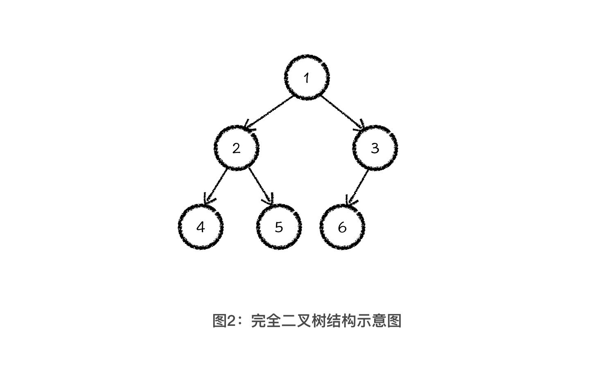

## 完全二叉树

完全二叉树是满二叉树的一种退化。它只缺少最后一排最右边的一些元素。如下图所示。



### 完全二叉树的特性

完全二叉树有一个优秀的特性。就是它可以保存在一个数组中，而不需要使用链表的方式来存储。
如果对完全二叉树中的节点编号，那么可以总结出一个规律。
如果父节点的编号是 i，那么它的左子节点的编号就是 2*i，右子节点的编号就是 2*i+1

> 实际上，在计算机中，我们会把数组作为完全二叉树的实际存储结构，而完全二叉树，则是我们重新看待这段数组信息的思维逻辑结构。因此，数据结构最大的价值，就是对我们思维逻辑结构的改造。

## 堆

> 堆（Heap）是一个可以被看成近似完全二叉树的数组。树上的每一个结点对应数组的一个元素。除了最底层外，该树是完全充满的，而且是从左到右填充。—— 来自：《算法导论》

堆其实就是使用完全二叉树实现的一种数据结构。分为大顶堆和小顶堆。

- 小顶堆；如果一个完全二叉树的每一个父节点的值都小于其子节点的值，那么就是一个小顶堆。
- 大顶堆；如果一个完全二叉树的每一个父节点的值都大于其子节点的值，那么就是一个大顶堆。

> 为了让你更好地学习堆这种数据结构，我要和你分享一个学习数据结构的公式：数据结构 = 结构定义 + 结构操作。结构定义和结构操作是组成数据结构最重要的两个部分，也是你之后在学任何一种数据结构时的重点内容。结构定义就是定义一种性质，结构操作就是维护这种性质。

### 堆的结构定义

- 大顶堆可以维护一个集合中的最大值。
- 小顶堆可以维护一个集合中的最小值。

### 堆的结构操作

- 插入新元素
  - 插入到最后面（数组的最后）
  - 向上调整，维护堆的特性
- 删除最值元素
  - 将最后一个元素覆盖堆顶元素（数组尾元素覆盖数组头元素）
  - 向下调整，维护堆的特性

### 堆排序

1. 对数组建立一个大顶堆
2. 每次将堆顶元素和堆尾元素调换位置（相当于把最大值放在了最后），然后减小堆的 size，从上到下维护堆
3. 执行 n 次之后，得到一个从小到达排序的数组

## 优先队列

> 优先队列好像就是堆的别名啊？其实不然。你可以把优先队列当成是一种概念，那它的定义就是一种可以实现根据优先级出队的结构。而堆只是实现优先队列的其中一种方式，当然也是最普遍的方式。

## 实现一个最(小)大堆

```typescript
abstract class Heap<T> {
  protected heap: T[] = [];
  protected getNumberForCompare: (val: T) => number;

  protected abstract compare(indexA: number, indexB: number): boolean;

  constructor(getNumberForCompare: (val: T) => number, values: T[] = []) {
    this.getNumberForCompare = getNumberForCompare;
    this.heapify(values);
  }

  // 交换堆内元素
  protected swap(indexA: number, indexB: number) {
    const temp = this.heap[indexA];
    this.heap[indexA] = this.heap[indexB];
    this.heap[indexB] = temp;
  }

  // 获取左孩子的索引
  protected getLeftChildIndex(index: number) {
    return 2 * index + 1;
  }

  // 获取右孩子的索引
  protected getRightChildIndex(index: number) {
    return 2 * index + 2;
  }

  // 获取父亲节点的索引
  protected getParentIndex(index: number) {
    if (index === 0) return null;
    return (index - 1) >>> 1;
  }

  // 初始化建堆
  protected heapify(values: T[]) {
    this.heap = values;
    // 完全二叉树的叶子节点的个数是总节点个数的一半。
    // 叶子节点本身不需要堆化。只需要等待后面的节点堆化。
    for (let i = this.heap.length >>> 1; i >= 0; i--) {
      this.heapifyDown(i);
    }
  }

  // 向上维护堆
  protected heapifyUp(index: number) {
    let currentIndex = index;
    let parentIndex = this.getParentIndex(currentIndex);
    while (parentIndex >= 0 && this.compare(currentIndex, parentIndex)) {
      this.swap(currentIndex, parentIndex);
      currentIndex = parentIndex;
      parentIndex = this.getParentIndex(parentIndex);
    }
  }

  // 向下维护堆
  protected heapifyDown(index: number) {
    let currentIndex = index;
    let lChildIndex = this.getLeftChildIndex(currentIndex);
    let rChildIndex = this.getRightChildIndex(currentIndex);

    const size = this.size();

    // 如果当前值大于左孩子
    if (lChildIndex < size && this.compare(lChildIndex, currentIndex)) {
      currentIndex = lChildIndex;
    }

    // 如果当前值大于右孩子
    if (rChildIndex < size && this.compare(rChildIndex, currentIndex)) {
      currentIndex = rChildIndex;
    }

    // 如果当前索引被替换
    if (currentIndex !== index) {
      this.swap(currentIndex, index);
      this.heapifyDown(currentIndex);
    }
  }

  // 获取堆的大小
  size() {
    return this.heap.length;
  }

  // 判断堆是否为空
  isEmpty() {
    return this.heap.length === 0;
  }

  // 插入元素
  insert(value: T): boolean {
    if (value != null) {
      this.heap.push(value);
      this.heapifyUp(this.heap.length - 1);
      return true;
    }
    return false;
  }

  // 删除堆顶元素
  extract(): T {
    if (this.isEmpty()) return null;

    if (this.size() === 1) return this.heap.shift();

    // 交换堆顶和堆尾元素
    this.swap(0, this.heap.length - 1);
    // 剔除最小元素
    const top = this.heap.pop();
    // 重新堆化
    this.heapifyDown(0);

    return top;
  }

  // 获取堆顶元素
  top(): T {
    return this.isEmpty() ? null : this.heap[0];
  }

  // 获取堆内元素
  values(): T[] {
    return [...this.heap];
  }
}

// 小顶堆
export class MinHeap<T> extends Heap<T> {
  protected compare(indexA: number, indexB: number): boolean {
    return (
      this.getNumberForCompare(this.heap[indexA]) <
      this.getNumberForCompare(this.heap[indexB])
    );
  }
}

// 大顶堆
export class MaxHeap<T> extends Heap<T> {
  protected compare(indexA: number, indexB: number): boolean {
    return (
      this.getNumberForCompare(this.heap[indexA]) >
      this.getNumberForCompare(this.heap[indexB])
    );
  }
}
```

## 参考

- [Typescript binary heap](https://www.davideaversa.it/blog/typescript-binary-heap/)
